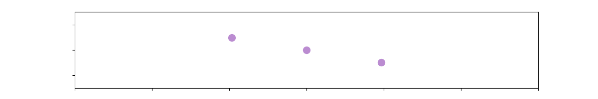

<h1 align="left">Olá! 👋🦆</h1>

Mestrando em Matemática Aplicada no IME-USP. Mexo com umas coisas divertidas.

- 🪐 Simulação de Problema de N-Corpos gravitacional;
- 🚀 Métodos numéricos em dinâmica conservativa;
- 🧐 O que mais der na telha.

<h3 align="left">👨‍💻 Tecnologias que uso</h3>

  
  

  
  
  
  
  
  

  

<h4 align="left">📚 Aprendendo no momento</h4>

  
  

